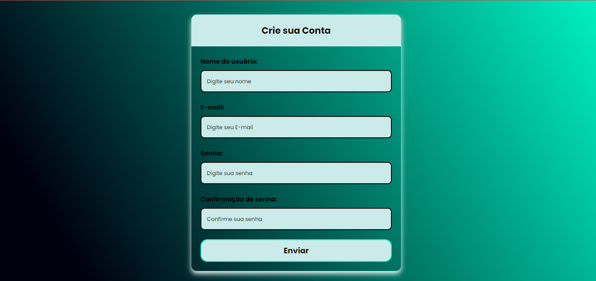

<h1 align="center">FORMULÁRIO DE CADASTRO</h1>

    Com intenção de praticar mais e aprender, resolvi fazer esse formulário de cadastro completo!

  <a href="#=tecnologias">Tecnologias</a> &nbsp;&nbsp;&nbsp;|&nbsp;&nbsp;&nbsp;
  <a href="#-projeto">Projeto</a> &nbsp;&nbsp;&nbsp;|&nbsp;&nbsp;&nbsp;
  <a href="#memo-licença">Licença</a>

  

 

    
    

## 🚀 Tecnologias

Esse projeto foi desenvolvido com as seguintes tecnologias:

- HTML
- CSS
- JAVASCRIPT
- Git e GitHub

## 💻 Projeto

Esse e um formulario de cadastro completo, feito com intuito de praticar, neste formulario para que se possa avançara para outra pagina deve-se prencher todos os campos, caso não ocorra o prenchimento, o usuario ira receber uma mensagem de alerta!

## :memo: Licença

Esse projeto está sob a licença MIT. Veja o arquivo [LICENSE](LICENSE.md) para mais detalhes.